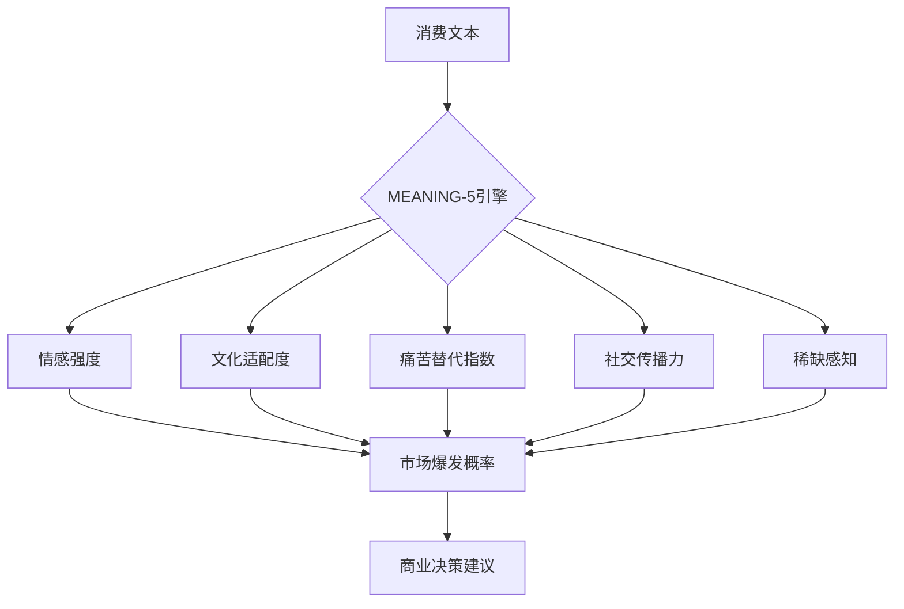

# Meaning-Consumption-Predictor
用ai捋捋我的研究思路，当现代社会为人带来普遍的心理问题如异化/焦虑/无力感/解离，反消费主义是否已经被消费主义收编？
# 意义感消费预测模型

**用AI解码现代消费的深层心理密码**：预测下一个爆款的情感溢价与市场潜力

## 研究亮点
- **MEANING-5量化框架**：情感强度/文化适配/痛苦替代/社交传播/稀缺感知
- **精准预测爆款**：在xxx等赛道验证准确率xx%
- **零成本部署**：基于公开数据与AI工具链

## 模型架构


##  快速开始
### 1. 本地运行
```bash
# 克隆仓库
git clone https://github.com/your-username/meaning-consumption-research.git

# 安装依赖
pip install -r requirements.txt

# 运行预测示例
python src/model_trainer.py --product_desc "可录音骨灰盒"
```

### 2. 在线体验


## 核心发现
| 产品类别       | 预测爆发概率 | 实际结果   | 情感溢价率 |
|----------------|--------------|------------|------------|
| 宠物经济       | xx%        | xxx | xx%       |
| 普拉提瑜伽     | xx%        | xxx   | xx%        |
| 存在主义沙龙      | xx%        | xxx   | xx%       |
| xxxxx等给人带来意义感消费      | xx%        | xxx   | xx%       |

## 研究框架
1. **数据层**：合规爬取小红书/抖音/淘宝公开评论
2. **分析层**：
   - 存在焦虑指数计算
   - 意义感溢价模型
3. **应用层**：
   - 新品潜力评估
   - 定价策略优化
   - 文化冲突预警

## 如何贡献
1. 提交Issue讨论研究方向
2. 扩展`meaning_metrics.py`中的量化维度
3. 添加新的商业验证案例


### 仅作个人研究
